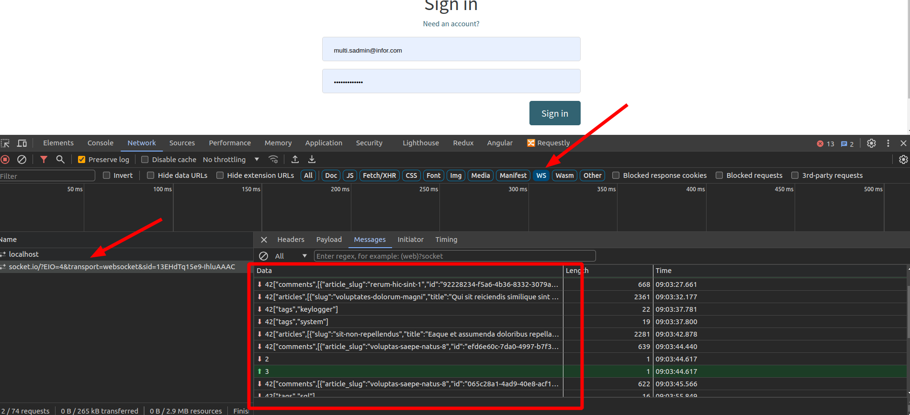

# API Documentation


# Socket.IO

This document explains how to set up a basic socket server using Socket.IO and Node.js, which reads articles from a JSON file and emits them to connected clients.

## Code Explanation

### Server and Socket.IO Setup

```javascript
const fs = require('fs');
var server = require('http').createServer();
var io = require("socket.io")(server, { cors: { origin: '*' } });
```

- **fs**: File system module for reading files.
- **server**: HTTP server instance created using Node.js.
- **io**: Socket.IO instance attached to the HTTP server with CORS enabled.

### Emit Articles Every 1 Minute

```javascript
function emitArticles() {
  setInterval(() => {
    // Your logic to read articles and emit them
    fs.readFile("./database.json", (err, data) => {
      if (err) {
        console.error("Error reading database:", err);
        return;
      }
      const articles = JSON.parse(data).articles.articles;
      io.emit('articles', articles);
    });
  }, 1 * 60 * 1000); // 1 minute in milliseconds
}
```

- **emitArticles**: Function to read articles from `database.json` and emit them to all connected clients every random time between 15 second to 1 minutes.
- **emitComments** and **emitTags**: Similar functions to emit comments and tags.
- **setInterval**: Executes the function at specified intervals (random time between 15 second to 1 minutes).
- **fs.readFile**: Reads the content of `database.json`.
- **io.emit**: Emits the articles to all connected clients.

### Socket.IO Connection Event

```javascript
io.on('connection', (socket) => {
  console.log('Client connected');

  emitArticles();
  emitComments();
  emitTags();
});
```

- **io.on('connection')**: Event listener for new client connections.
- **socket.emit**: Sends the articles to the newly connected client.

### Server Listening on Port 5000

```javascript
server.listen(5000, () => {
  console.log('Socket server listening on port 5000');
});
```

- **server.listen**: Starts the server on port 5000.
- **emitArticles**: Invokes the function to start emitting articles.
- **emitComments** and **emitTags**: Similar functions to emit comments and tags.

 
###  Run the Socket Server

Execute the following command to start the socket server:

```bash
npm run socket
```
This will run the server on port 5000, and you should see the message "Socket server listening on port 5000" in the console.

## Example Output

When a client connects to the socket server, the server emits the articles to the client. The client can then display the articles in the UI.

