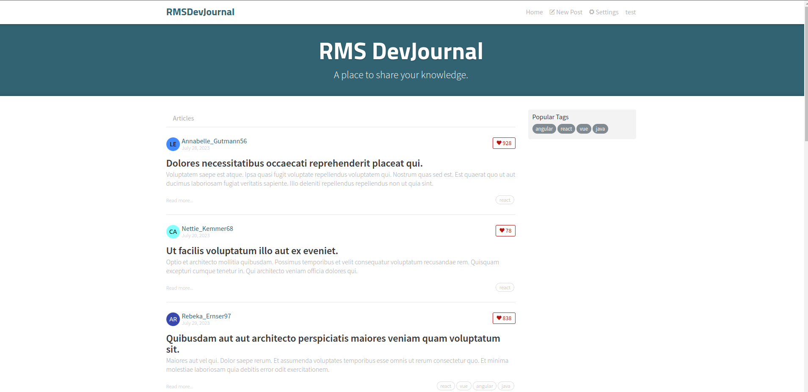
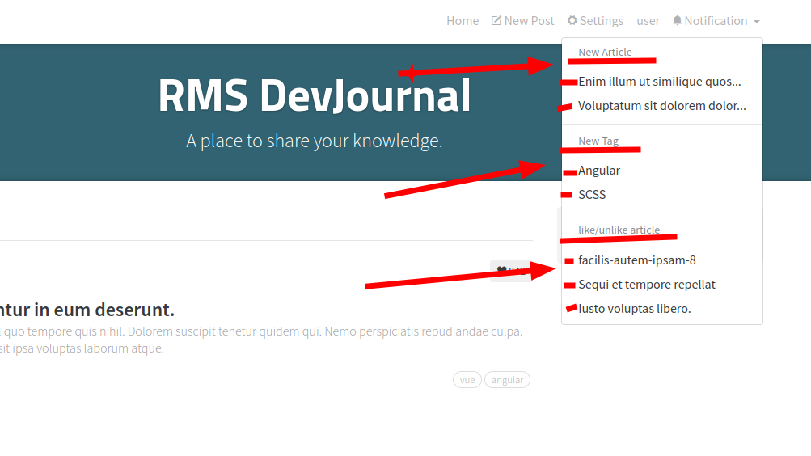
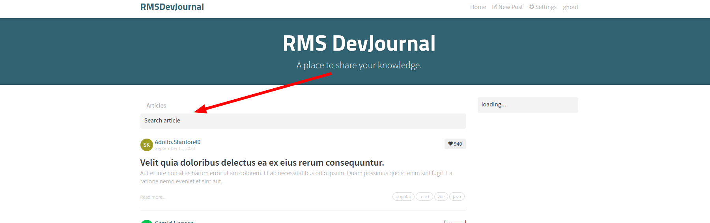
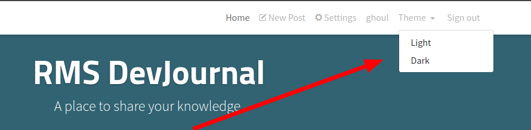
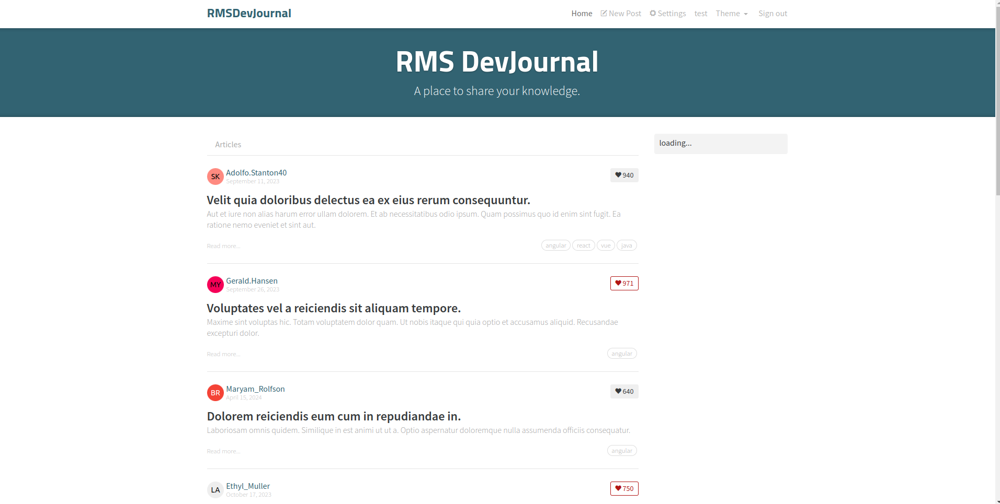
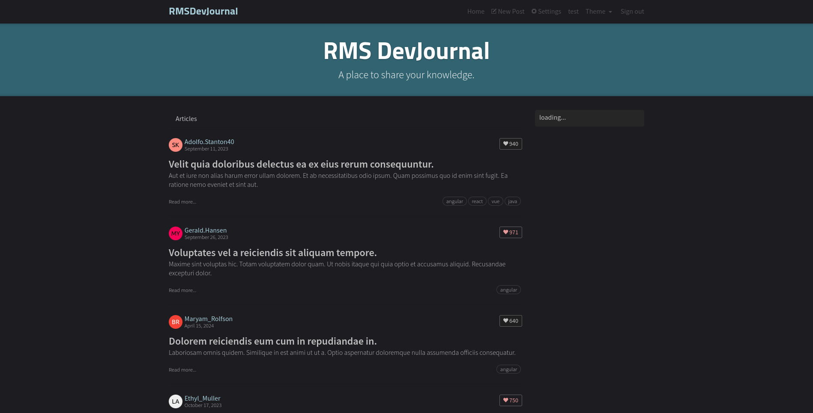
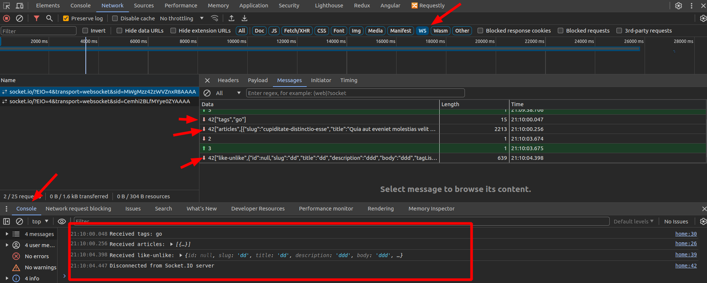

# RMS DevJournal APP Project

## Introduction

Welcome to the RMS DevJournal homework project! In this assignment, you'll be working on a full-stack web application built with Angular. The project aims to provide a platform for users to read and write articles on various topics.

## Project Description

RMS DevJournal is a web application designed to provide users with a range of functionalities. Users can authenticate using JWT on the login/signup pages, and a convenient logout button is available on the settings page. The platform supports user management, allowing users to sign up and edit their profile information on the settings page without the option to delete accounts. Users can create, read, update, and delete articles through the editor page, with articles displayed in Markdown format. The comment system enables users to create, read, and delete comments on articles. Pagination is implemented to optimize the performance and user experience of article lists. Additionally, users can favorite articles and track their favorite articles list on their profile page. The platform also allows users to follow other users and receive updates on their articles



## Project Setup

Follow these steps to set up the project on your local machine:

1. **Clone the Repository**: 
   - Use `git clone https://github.com/ghoul007/DevJournal.git` to clone the project repository.

2. **Navigate to the Project Directory**:
   - Use `cd DevJournal` to move into the project directory.

3. **Install Dependencies**:
   - Run `npm install` to install all necessary dependencies for the project.
```sh
npm run install:all
```

4. **Run the Application**:


To start both the API and frontend servers concurrently:

```sh
npm run start
```
5. **Run the websocket**:
To start the socket server:

```sh
npm run socket
```
Remark: The frontend and API can be installed and run separately with these commands:
 
```sh
cd api && npm i && npm run start
cd api && npm i && nodemon socket
cd frontend && npm i && npm run start
```
 


6. **Access the Application**:

   - Access the application in your browser at `http://localhost:4200`.
   - The API server runs on `http://localhost:3000`.
   - The socket server runs on `wss://localhost:5000`.

## Project Structure

The project follows a modular structure for better organization:

- **src/app**: Contains Angular components, services, and modules.
  - **components**: Reusable UI components used across the application.
  - **pages**: Top-level components representing different pages of the application.
  - **services**: Angular services for data management and API communication.
  - **models**: TypeScript interfaces representing data models.
  - **guards**: Angular route guards for implementing authentication and authorization logic.
  - **interceptors**: HTTP interceptors for handling JWT authentication tokens and API requests.

- **src/assets**: Contains static assets such as images and stylesheets.

 ###  [➡️  Read more](./frontend/README.md#readme)

## Page Breakdown
- **Home Page**: Displays trending tags and lists articles from the global feed or by selected tags.
- **Sign In/Sign Up Pages**: Provides forms for user authentication.
- **Settings Page**: Allows users to update their profile information.
- **Editor Page**: Create and edit articles using a Markdown editor.
- **Article Page**: Displays individual articles with comments. Allows article authors to delete articles.
- **Profile Page**: Shows user information and activity. Lists articles created by the user and their favorite articles.


## <span style="color:red; background:black; font-weight:bold;"> Homework Tasks</span>


Sure, here is the list with just the titles and checkboxes:

### Homework Assignment Tasks

 

- [ ] New Article Received in Real Time
- [ ] New Tags in Real Time
- [ ] Real-time Like and Unlike Articles
- [ ] Real-time Notifications Menu
- [ ] Search Articles
- [ ] Replace Pagination with Infinite Scroll
- [ ] Dark Mode
- [ ] Add Enhancements (Loading, Redirection, etc.)
 

As part of your homework assignment, you're required to complete the following tasks:

1. ***New Article Received in Real Time***
   - **Description:** Implement a feature that enables users to append newly received articles via Socket.IO in real-time without needing to refresh the page.
   - **Requirement:** All data received from Socket.IO should also be stored in the database. You can use a specific API endpoint like   [Create Article](./api/README.md#create-article)..

2. ***New Tags in Real Time***
   - **Description:** Implement a feature that allows users to see new tags added to articles in real-time without needing to refresh the page.
   - **Requirement:** All data received from Socket.IO should also be stored in the database. You can use a specific API endpoint like   [Add Tag](./api/README.md#add-tag).

3. ***Real-time Like and Unlike Articles***
   - **Description:** Implement a feature to show real-time updates when a user likes or unlikes an article without refreshing the page.
   - **Requirement:** All data received from Socket.IO realetd to like and unlike is already stored in the database. 

4. ***Real-time Notifications Menu***

   - **Description:** Implement a feature to display all notifications received in a notification menu, grouped by type (e.g., new articles, new tags, likes/unlikes) in real-time without needing to refresh the page.
   - **Requirement:** All data received from Socket.IO should also be stored in a notification table in the database to ensure data persistence. You can use appropriate API endpoints as needed.

    - [Get all Notifications](./api/README.md#get-notifications-from-the-database).


   - [Save notification (new Article)](./api/README.md#save-notification-new-article-into-the-database)
   - [Save notification (new tag)](./api/README.md#save-notification-new-tag-into-the-database)
   - [Save notification (like/unlike)](./api/README.md#save-notification-likeunlike-into-the-database)

 

5. ***Search Articles***
   - **Description:** Implement a feature to search for articles by title or tag.
   - **Requirement:** You can use a specific API endpoint like  [Search Articles](./api/README.md#search-articles-by-title).
   

6. ***Replace pagination with Infinite Scroll***
   - **Description:** Implement infinite scrolling to replace the pagination feature on the Home Page.
   - **Requirement:** Load more articles as the user scrolls down the page. You can use a specific API endpoint like  [Get Articles](./api/README.md#get-articles).

   -> you can use  [Infinite Scroll](https://www.npmjs.com/package/ngx-infinite-scroll)

7. ***Dark Mode***
   - **Description:** Implement a dark mode feature that allows users to switch between light and dark themes.
   - **Requirement:** Add a toggle button in the settings page to switch between light and dark themes.



| Light Mode                            | Dark Mode                             |
|---------------------------------------|---------------------------------------|
|  |  |

8. ***Add Enhancements (Loading, Redirection, etc.)***
  - **Description:** Add various enhancements such as loading indicators, redirection, etc., when creating an article, adding a comment, and navigating through pagination.
  - **Requirement:** Ensure the user experience is smooth and intuitive by implementing these enhancements where appropriate.

## Submission Guidelines

- Complete the assigned tasks within the given timeframe.
- Ensure your code follows best practices in Angular development.
- Submit your homework project as per the instructions provided by your instructor.

## Endpoints

### User Registration

#### Register New User

- **Endpoint:** `POST /users`
- **Description:** Registers a new user.
- **Request Body:**

  ```json
  {
    "user": {
      "email": "user@example.com",
      "password": "password",
      "username": "username"
    }
  }
  ```

- **Response:**

  ```json
  {
    "user": {
      "token": "access_token",
      "email": "user@example.com",
      "username": "username",
      "image": "image_url",
      "bio": "I am a new hire at the company INFOR"
    }
  }
  ```
  


 ###  [➡️  Read more](./api/README.md#readme)


## SocketIO

###  Run the Socket Server

Execute the following command to start the socket server:

```bash
npm run socket
```
This will run the server on port 5000, and you should see the message "Socket server listening on port 5000" in the console.

 ###  [➡️  Read more](./api/SOCKETIO.md#readme)

## Run Project

Here is a `package.json` script configuration based on your provided scripts:

```json
{
  "scripts": {
    "install:api": "cd api && npm i",
    "install:frontend": "cd frontend && npm i",
    "install:main": "npm i",
    "install:all": "npm run install:api && npm run install:frontend && npm run install:main",
    "start:api": "cd api && npm run start",
    "start:front": "cd frontend && npm run start",
    "start": "concurrently \"npm run start:api\" \"npm run start:front\"",
    "generate:api": "cd api && npm run generate",
    "socket": "cd api && npm run socket"
  },
  "devDependencies": {
    "concurrently": "^6.2.1"
  }
}
```

### Explanation of the Scripts

- **Installation Scripts:**
  - `install:api`: Installs dependencies in the `api` directory.
  - `install:frontend`: Installs dependencies in the `frontend` directory.
  - `install:main`: Installs dependencies in the root directory.
  - `install:all`: Runs all the installation scripts sequentially.

- **Start Scripts:**
  - `start:api`: Starts the API server by navigating to the `api` directory and running the start script.
  - `start:front`: Starts the frontend server by navigating to the `frontend` directory and running the start script.
  - `start`: Uses `concurrently` to run both `start:api` and `start:front` scripts simultaneously.

- **Other Scripts:**
  - `generate:api`: Runs the `generate` script to generate fake articles in the `api` directory.
  - `socket`: Runs the `socket` script in the `api` directory.

## Tips
### Generating Fake Articles

- `generate:api`: This script generates fake articles on the API server. You can adjust the number of articles to generate (n=10, 100, 1000, etc.) in the generate.js file. Once updated, execute the script using the following command:

  ```sh
  npm run generate:api
  ```

### show the log of socket.io
-  You can view the log in the console or network tab of the browser's developer tools.



### Connecting to the app
- To log in, please use the provided credentials:
  - **Email:** `user@infor.com
  - **Password:** `user@123`

You also have the option to <b>subscribe</b> and create your own account."
 


## Resources

- Angular Documentation: [https://angular.io/docs](https://angular.io/docs)
- Angular CLI Documentation: [https://angular.io/cli](https://angular.io/cli)


